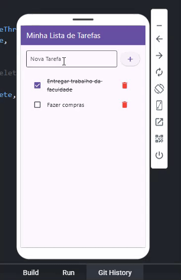

# ✅ Lista de Tarefas - Uni-FACEF | Desenvolvimento Mobile I

Aplicativo de Lista de Tarefas desenvolvido em Flutter como parte da avaliação do 2º Bimestre da disciplina **Desenvolvimento de Software para Dispositivos Móveis I**, no curso de Engenharia de Software do Uni-FACEF.


## ✨ Funcionalidades

- Adição de novas tarefas
- Marcação e desmarcação de tarefas como concluídas
- Remoção de tarefas da lista
- Interface simples, responsiva e de fácil usabilidade

## 🚀 Como Executar o Projeto

### Pré-requisitos

- [Git](https://git-scm.com)
- [Flutter SDK](https://flutter.dev) (versão 3.x ou superior)

### Passos para execução

```bash
# Clone o repositório
git clone https://github.com/SEU-USUARIO/SEU-REPOSITORIO.git

# Acesse o diretório do projeto
cd SEU-REPOSITORIO

# Instale as dependências
flutter pub get

# Execute o aplicativo
flutter run
```

## 🛠️ Tecnologias Utilizadas

- **Flutter**
- **Dart**

## 🎥 Vídeo de Demonstração

A funcionalidade do aplicativo pode ser visualizada no vídeo abaixo:



## 🌐 Versão Web

A aplicação também está disponível para testes diretamente no navegador:

[🔗 Acesse a versão Web](https://preview.flutlab.io/thales_leal/listadetarefas/)

---

## 📌 Informações Complementares

Este projeto foi desenvolvido por **[Thales Vinícius Leal Barcelos - 24740]** como parte das atividades acadêmicas do curso de Engenharia de Software.

---

